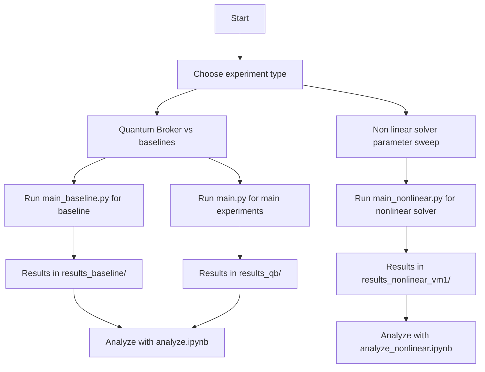

# Quantum Broker Experiments

This repository contains experiments using the Quantum Broker tool (`qb.py`) for benchmarking quantum circuit executions and exploring solver strategies. It is designed for researchers and students interested in quantum computing, optimization, and hybrid solver workflows.

## Main Experiment Files

- **Baseline Experiments:** [`main_baseline.py`](main_baseline.py:1)
  - Runs baseline quantum circuit executions on simulated backends.
  - Outputs results to `results_baseline/`.

- **Main Experiments:** [`main.py`](main.py:1)
  - Launches experiments comparing linear and nonlinear optimization strategies.
  - Outputs results to `results_qb/`.

- **Nonlinear Solver Experiments:** [`main_nonlinear.py`](main_nonlinear.py:1)
  - Explores nonlinear solver configurations across circuit groups.
  - Outputs results to `results_nonlinear_vm2/`.

## Results Analysis and Plotting

- Two Jupyter notebooks are provided for analyzing and plotting the results:
  - [`analyze.ipynb`](analyze.ipynb:1): Analysis and visualization of baseline and main experiment results.
  - [`analyze_nonlinear.ipynb`](analyze_nonlinear.ipynb:1): Analysis and visualization of nonlinear solver experiment results.

## Setup Instructions

1. **Clone the repository:**
   ```bash
   git clone https://github.com/yourusername/quantum-broker-experiments.git
   cd quantum-broker-experiments
   ```

2. **Install dependencies:**
   ```bash
   pip install numpy scipy sympy pulp qiskit tqdm qbraid jupyter
   ```

3. **Configure settings:**
   - Edit `config.ini` to adjust providers, backends, circuit files, optimizer type, and result folder.

## Usage Examples

- **Run baseline experiments:**
  ```bash
  python main_baseline.py
  ```

- **Run main experiments:**
  ```bash
  python main.py
  ```

- **Run nonlinear solver experiments (specify circuit group folder of circuits_nonlinear/):**
  ```bash
  python main_nonlinear.py 1
  ```

- **Analyze and plot results:**
  ```bash
  jupyter notebook analyze.ipynb
  jupyter notebook analyze_nonlinear.ipynb
  ```

## Results

- Baseline results: `results_baseline/`
- Main experiment results: `results_qb/`
- Nonlinear solver results: `results_nonlinear_vm1/`

Each output file is a JSON containing:
- Algorithm, circuit size, scenario values
- Total cost, max execution time, minimum fidelity
- Dispatch information

## Workflow Diagram



## License

This project is licensed under the AGPL-3.0 License.
